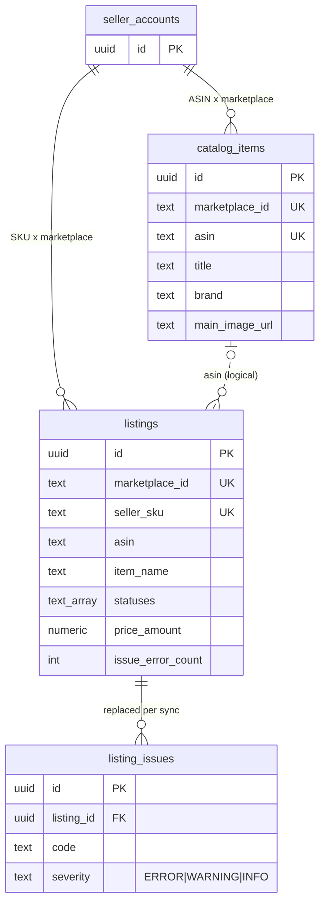

# ERD — `catalog`

DDL: `db/design/08_catalog.sql`. All rows carry `tenant_id`, `seller_account_id`.

```mermaid
erDiagram
  seller_accounts ||--o{ listings : "SKU x marketplace"
  listings ||--o{ listing_issues : "replaced per sync"
  seller_accounts ||--o{ catalog_items : "ASIN x marketplace"
  catalog_items |o..o{ listings : "asin (logical)"

  listings {
    uuid id PK
    text marketplace_id UK
    text seller_sku UK
    text asin
    text item_name
    text_array statuses
    numeric price_amount
    int issue_error_count
  }
  listing_issues {
    uuid id PK
    uuid listing_id FK
    text code
    text severity "ERROR|WARNING|INFO"
  }
  catalog_items {
    uuid id PK
    text marketplace_id UK
    text asin UK
    text title
    text brand
    text main_image_url
  }
  seller_accounts {
    uuid id PK
  }
```
