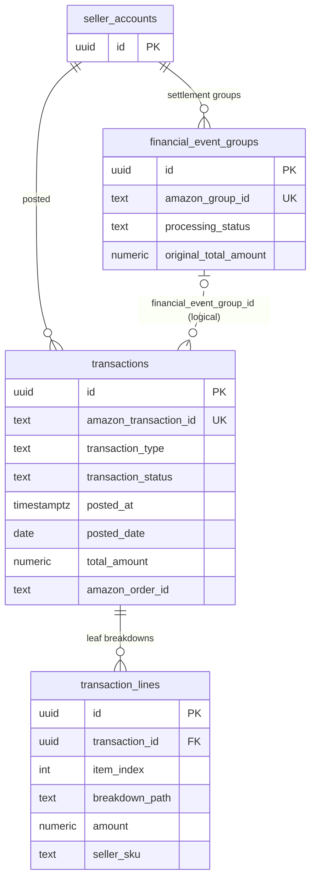

# ERD — `finance`

DDL: `db/design/11_finance.sql`. Fee totals per SKU/day: `facts.finance_sku_daily` ([erd-facts.md](erd-facts.md)).

```mermaid
erDiagram
  seller_accounts ||--o{ transactions : "posted"
  transactions ||--o{ transaction_lines : "leaf breakdowns"
  seller_accounts ||--o{ financial_event_groups : "settlement groups"
  financial_event_groups |o..o{ transactions : "financial_event_group_id (logical)"

  transactions {
    uuid id PK
    text amazon_transaction_id UK
    text transaction_type
    text transaction_status
    timestamptz posted_at
    date posted_date
    numeric total_amount
    text amazon_order_id
  }
  transaction_lines {
    uuid id PK
    uuid transaction_id FK
    int item_index
    text breakdown_path
    numeric amount
    text seller_sku
  }
  financial_event_groups {
    uuid id PK
    text amazon_group_id UK
    text processing_status
    numeric original_total_amount
  }
  seller_accounts {
    uuid id PK
  }
```
