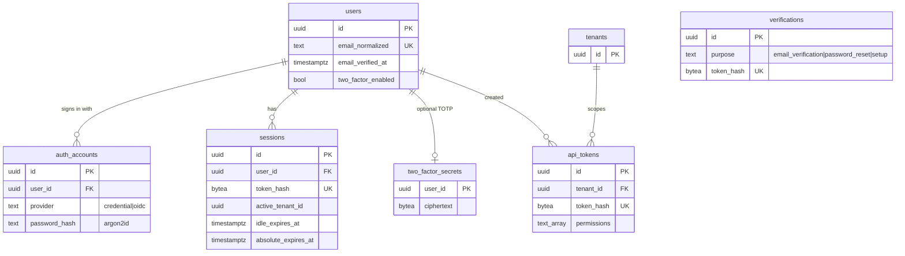

# ERD — `identity`

DDL: `db/design/02_identity.sql` (`api_tokens` in `03_core.sql`). Global (no tenant) except `api_tokens`.

```mermaid
erDiagram
  users ||--o{ auth_accounts : "signs in with"
  users ||--o{ sessions : "has"
  users ||--o| two_factor_secrets : "optional TOTP"
  users ||--o{ api_tokens : "created"
  tenants ||--o{ api_tokens : "scopes"

  users {
    uuid id PK
    text email_normalized UK
    timestamptz email_verified_at
    bool two_factor_enabled
  }
  auth_accounts {
    uuid id PK
    uuid user_id FK
    text provider "credential|oidc"
    text password_hash "argon2id"
  }
  sessions {
    uuid id PK
    uuid user_id FK
    bytea token_hash UK
    uuid active_tenant_id
    timestamptz idle_expires_at
    timestamptz absolute_expires_at
  }
  verifications {
    uuid id PK
    text purpose "email_verification|password_reset|setup"
    bytea token_hash UK
  }
  two_factor_secrets {
    uuid user_id PK
    bytea ciphertext
  }
  api_tokens {
    uuid id PK
    uuid tenant_id FK
    bytea token_hash UK
    text_array permissions
  }
  tenants {
    uuid id PK
  }
```
