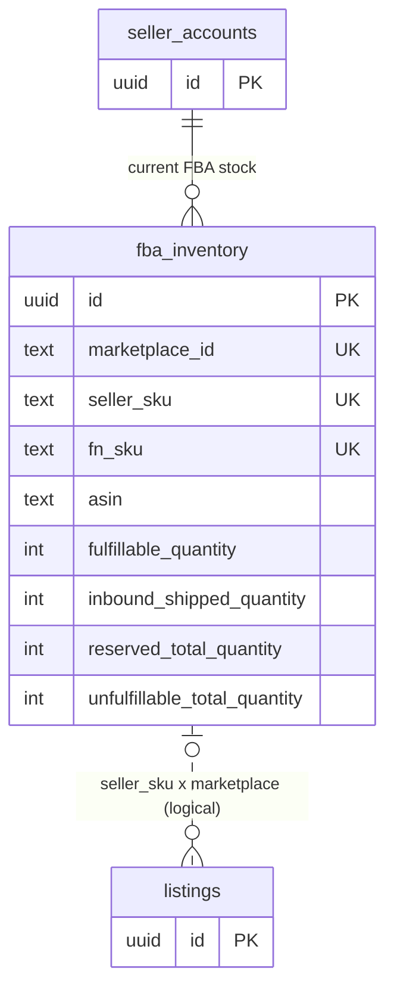

# ERD — `inventory`

DDL: `db/design/09_inventory.sql`. Daily history: `facts.inventory_fba_daily` ([erd-facts.md](erd-facts.md)).

```mermaid
erDiagram
  seller_accounts ||--o{ fba_inventory : "current FBA stock"
  fba_inventory |o..o{ listings : "seller_sku x marketplace (logical)"

  fba_inventory {
    uuid id PK
    text marketplace_id UK
    text seller_sku UK
    text fn_sku UK
    text asin
    int fulfillable_quantity
    int inbound_shipped_quantity
    int reserved_total_quantity
    int unfulfillable_total_quantity
  }
  seller_accounts {
    uuid id PK
  }
  listings {
    uuid id PK
  }
```
