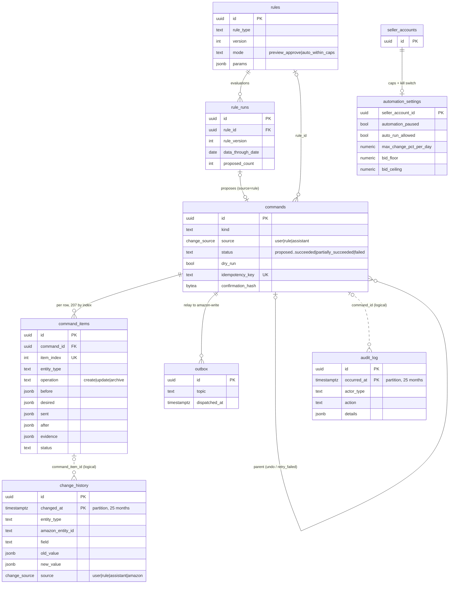

# ERD — `ops` (commands, audit, history, rules)

DDL: `db/design/07_ops.sql`. All rows carry `tenant_id`; all but `audit_log` carry `seller_account_id`.

```mermaid
erDiagram
  commands ||--o{ command_items : "per row, 207 by index"
  commands ||--o{ outbox : "relay to amazon-write"
  commands |o--o{ commands : "parent (undo / retry_failed)"
  rules ||--o{ rule_runs : "evaluations"
  rule_runs |o--o| commands : "proposes (source=rule)"
  rules |o--o{ commands : "rule_id"
  seller_accounts ||--o| automation_settings : "caps + kill switch"
  command_items |o..o{ change_history : "command_item_id (logical)"
  commands |o..o{ audit_log : "command_id (logical)"

  commands {
    uuid id PK
    text kind
    change_source source "user|rule|assistant"
    text status "proposed..succeeded|partially_succeeded|failed"
    bool dry_run
    text idempotency_key UK
    bytea confirmation_hash
  }
  command_items {
    uuid id PK
    uuid command_id FK
    int item_index UK
    text entity_type
    text operation "create|update|archive"
    jsonb before
    jsonb desired
    jsonb sent
    jsonb after
    jsonb evidence
    text status
  }
  outbox {
    uuid id PK
    text topic
    timestamptz dispatched_at
  }
  audit_log {
    uuid id PK
    timestamptz occurred_at PK "partition, 25 months"
    text actor_type
    text action
    jsonb details
  }
  change_history {
    uuid id PK
    timestamptz changed_at PK "partition, 25 months"
    text entity_type
    text amazon_entity_id
    text field
    jsonb old_value
    jsonb new_value
    change_source source "user|rule|assistant|amazon"
  }
  automation_settings {
    uuid seller_account_id PK
    bool automation_paused
    bool auto_run_allowed
    numeric max_change_pct_per_day
    numeric bid_floor
    numeric bid_ceiling
  }
  rules {
    uuid id PK
    text rule_type
    int version
    text mode "preview_approve|auto_within_caps"
    jsonb params
  }
  rule_runs {
    uuid id PK
    uuid rule_id FK
    int rule_version
    date data_through_date
    int proposed_count
  }
  seller_accounts {
    uuid id PK
  }
```
