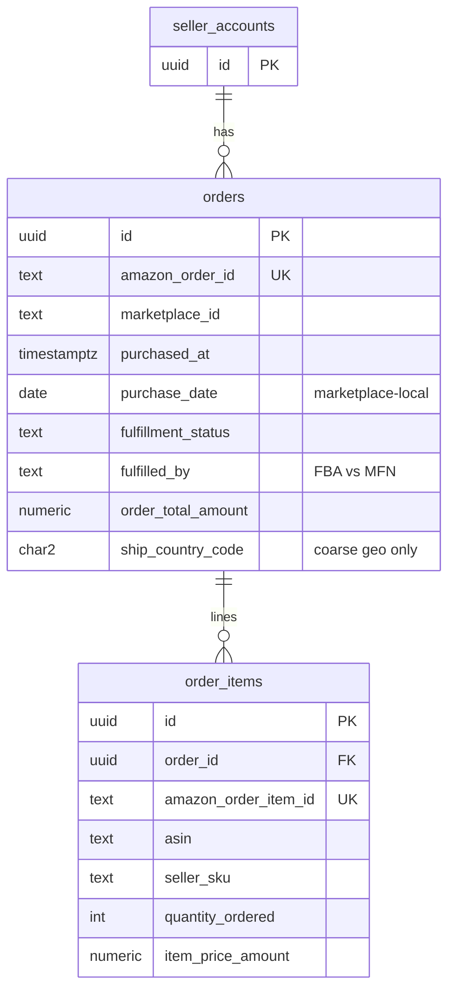

# ERD — `orders` (no PII, D11)

DDL: `db/design/10_orders.sql`. Order metrics per day: `facts.sales_daily` ([erd-facts.md](erd-facts.md)).

```mermaid
erDiagram
  seller_accounts ||--o{ orders : "has"
  orders ||--o{ order_items : "lines"

  orders {
    uuid id PK
    text amazon_order_id UK
    text marketplace_id
    timestamptz purchased_at
    date purchase_date "marketplace-local"
    text fulfillment_status
    text fulfilled_by "FBA vs MFN"
    numeric order_total_amount
    char2 ship_country_code "coarse geo only"
  }
  order_items {
    uuid id PK
    uuid order_id FK
    text amazon_order_item_id UK
    text asin
    text seller_sku
    int quantity_ordered
    numeric item_price_amount
  }
  seller_accounts {
    uuid id PK
  }
```
