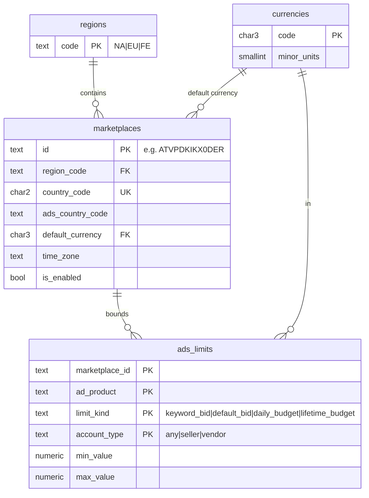

# ERD — `ref`

DDL: `db/design/01_ref.sql`. Global, read-only for `sh_app`, seeded by migration.

```mermaid
erDiagram
  regions ||--o{ marketplaces : "contains"
  currencies ||--o{ marketplaces : "default currency"
  marketplaces ||--o{ ads_limits : "bounds"
  currencies ||--o{ ads_limits : "in"

  regions {
    text code PK "NA|EU|FE"
  }
  currencies {
    char3 code PK
    smallint minor_units
  }
  marketplaces {
    text id PK "e.g. ATVPDKIKX0DER"
    text region_code FK
    char2 country_code UK
    text ads_country_code
    char3 default_currency FK
    text time_zone
    bool is_enabled
  }
  ads_limits {
    text marketplace_id PK
    text ad_product PK
    text limit_kind PK "keyword_bid|default_bid|daily_budget|lifetime_budget"
    text account_type PK "any|seller|vendor"
    numeric min_value
    numeric max_value
  }
```
